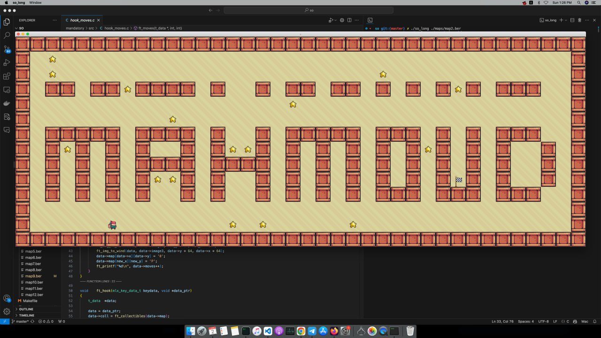
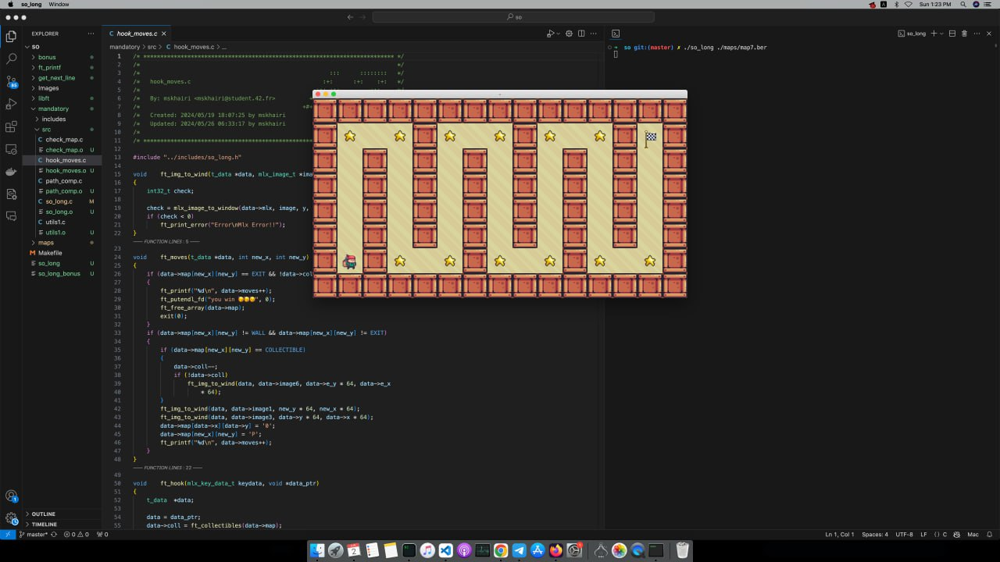

# 42 So Long Project

# mahmoud map

  

# snake map

  

## Project Overview

The **So Long** project is a graphical game developed using the MiniLibX library, aimed at mastering the fundamentals of 2D game development in C. The project requires creating a player character that navigates a predefined map, collecting items and avoiding obstacles, enhancing skills in graphics, input handling, and game logic.

## Features

<ul>
  <li>2D graphics rendering using the MiniLibX library.</li>
  <li>Player movement with keyboard controls.</li>
  <li>Map generation with collectibles and obstacles.</li>
  <li>Collision detection and game state management.</li>
</ul>

## Installation

To install and run this project:

<pre>
git clone https://github.com/your_username/so_long.git
cd so_long
make
</pre>

## Usage

Here’s how to start the So Long game:

<pre>
#include "so_long.h"

int main(int argc, char *argv[]) {
    if (argc != 2) {
        ft_printf("Usage: ./so_long <map_file>\n");
        return (1);
    }
    start_game(argv[1]);
    return (0);
}
</pre>

## License

This project is licensed under the MIT License.

## Contact

For any questions or collaborations, please reach out:

<ul>
  <li>Email: your_email@example.com</li>
  <li>GitHub: <a href="https://github.com/your_username">your_username</a></li>
</ul>